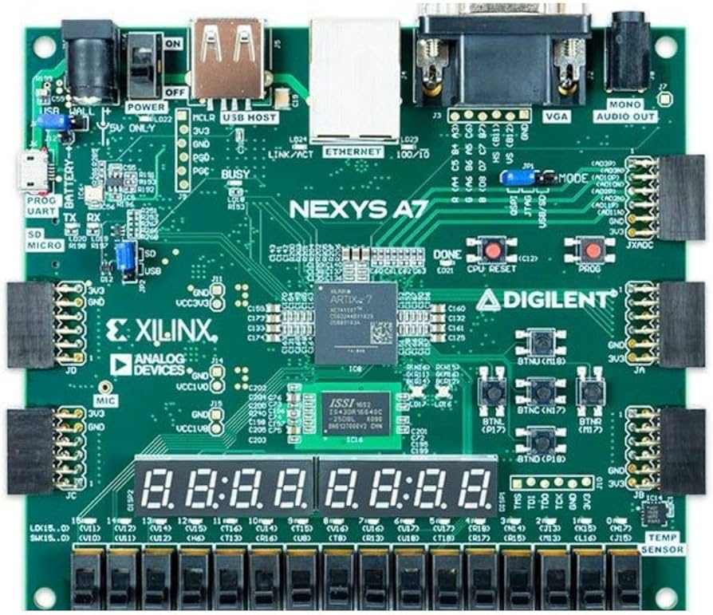
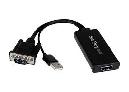

# CPE487_Final_Project - Agar.io Game 
## Description
In the game agario, you control a main ball and move over the other balls on the screen. Each of the other balls could either increase or decrease your overall score. 

Goal: Grow your main ball size. 

Playing: 
  - Use BTNC to start the game.
  - Use BTNU to move up, BTND to move down, BTNR to move right, and BTNL to move left.
    
Scoring: When the ball has reached a certain size the game will end.

## Required Attachments
For game play, you will need the following
- Nexys A7-100T Board
  


- VGA to HDMI Adapter
  


- Monitor
  


## Steps to Run
Download the following files from this repository onto your computer
- `ball.vhd`
- `clk_wiz_0_clk_wiz.vhd`
- `clk_wiz_0.vhd`
- `leddec16.vhd`
- `vga_sync.vhd`
- `agario.xdc`
- `agario.vhd`

### Module Hierarchy
 
Once downloaded, follow these steps:
1. Create a new project on Vivado
2. Add all the `.vhd` files as source files to the project
3. Add the `.xdc` file as a constraint file to the project
4. Choose Nexys A7-100T board for the project
5. Run the synthesis
6. Run the implementation
7. Generate the bistream
8. Open the hardware manager and click
   - 'Open Target'
   - 'Auto Connect'
   - 'Program Device'
     
9. Push the BTNC button to start the game

## Inputs and Outputs
### `agario.vhd`
```
ENTITY agario IS
    PORT (
        clk_in : IN STD_LOGIC; -- system clock
        VGA_red : OUT STD_LOGIC_VECTOR (3 DOWNTO 0); -- VGA outputs
        VGA_green : OUT STD_LOGIC_VECTOR (3 DOWNTO 0);
        VGA_blue : OUT STD_LOGIC_VECTOR (3 DOWNTO 0);
        VGA_hsync : OUT STD_LOGIC;
        VGA_vsync : OUT STD_LOGIC;
        btnl : IN STD_LOGIC;
        btnr : IN STD_LOGIC;
        btnd : IN STD_LOGIC;
        btnu : IN STD_LOGIC;
        btn0 : IN STD_LOGIC;
        sw : IN STD_LOGIC_VECTOR (1 DOWNTO 0);
        SEG7_anode : OUT STD_LOGIC_VECTOR (7 DOWNTO 0); -- anodes of four 7-seg displays
        SEG7_seg : OUT STD_LOGIC_VECTOR (6 DOWNTO 0)
    ); 
END agario
```
#### Inputs
- clk_in: System clock
- BTNL: This input corresponds to the button on the left so that the ball can move left (Input port P17)
- BTNR: This input corresponds to the button on the right so that the ball can move right (Input port M17)
- BTND: This input corresponds to the bottom button so that the ball can move down (Input port P18)
- BTNU: This input corresponds to the top button so that the ball can move up (Input port M18)
- BTN0: This input corresponds to the middle button so that the game can start (Input port N17)
#### Outputs
- SEG7_anode: Corresponds to the 8 different LED segments that will be lit up
- SEG7_seg: Determines what will be displayed on each anode
- VGA_red, VGA_green, VGA_blue, VGA_hsync, VGA_vsync: Display the code and color on monitor

### `ball.vhd`
```
ENTITY ball IS
    PORT (
        clk : IN STD_LOGIC_VECTOR (20 DOWNTO 0); -- system clock in vector form
        clk_in : IN STD_LOGIC; -- system clock
        v_sync : IN STD_LOGIC;
        pixel_row : IN STD_LOGIC_VECTOR(10 DOWNTO 0);
        pixel_col : IN STD_LOGIC_VECTOR(10 DOWNTO 0);
        mainball_x : IN STD_LOGIC_VECTOR(10 DOWNTO 0); -- main ball x position
        mainball_y : IN STD_LOGIC_VECTOR(10 DOWNTO 0); -- main ball y position
        start_game : IN STD_LOGIC; -- initiates serve
        sw : IN STD_LOGIC_VECTOR (1 DOWNTO 0); -- condition for switch
        score : OUT STD_LOGIC_VECTOR (7 DOWNTO 0); -- display score
        timer : OUT STD_LOGIC_VECTOR (7 DOWNTO 0); -- display timer
        red : OUT STD_LOGIC;
        green : OUT STD_LOGIC;
        blue : OUT STD_LOGIC
    );
END ball;
```
#### Inputs
- clk: Mapped system clock in vector form 
- clk_in: Mapped system clock
- v_sync: Syncs code to VGA monitor
- pixel_row, pixel_col: Row or column position
- mainball_x, mainball_y: x and y coordinates of the main ball
- start_game: Initiates serve
- sw: Condition for board switch
#### Outputs
- score, timer: Mapped onto display to show the score and countdown timer on the board
- red, green, blue: Colors to display on the monitor

### `leddec16.vhd`
```
ENTITY leddec16 IS
	PORT (
		dig : IN STD_LOGIC_VECTOR (2 DOWNTO 0); -- which digit to currently display
		data1 : IN STD_LOGIC_VECTOR (7 DOWNTO 0);
		data2 : IN STD_LOGIC_VECTOR (7 DOWNTO 0); 
		anode : OUT STD_LOGIC_VECTOR (7 DOWNTO 0); -- which anode to turn on
		seg : OUT STD_LOGIC_VECTOR (6 DOWNTO 0)); -- segment code for current digit
END leddec16;
```
#### Inputs
- dig: Determines which digit to display on the board
- data1, data2: 2 separate displays for 2 different 2-digit datasets
- anode: Determines which anode to turn on
#### Outputs
- seg: Segment code for current digit
## Modifications
### `leddec16.vhd`
_This code originated from the `leddec16.vhd` file in Lab 6_
```
ARCHITECTURE Behavioral OF leddec16 IS
	SIGNAL data4 : STD_LOGIC_VECTOR (3 DOWNTO 0); -- binary value of current digit
BEGIN
	-- Select digit data to be displayed in this mpx period
	data4 <= data2(3 DOWNTO 0) WHEN dig = "000" ELSE -- digit 0
	         data2(7 DOWNTO 4) WHEN dig = "001" ELSE -- digit 1
	         data1(3 DOWNTO 0) WHEN dig = "110" ELSE -- digit 2
	         data1(7 DOWNTO 4) WHEN dig = "111"; -- digit 3
```
- data1 and data2 represent two different datasets to display on the board.
```
anode <= "11111110" WHEN dig = "000" ELSE -- 0
         "11111101" WHEN dig = "001" ELSE -- 1
--	 "11111011" WHEN dig = "010" ELSE -- 2
--       "11110111" WHEN dig = "011" ELSE -- 3
--	 "11101111" WHEN dig = "100" ELSE -- 4
--	 "11011111" WHEN dig = "101" ELSE -- 5
         "10111111" WHEN dig = "110" ELSE -- 6
         "01111111" WHEN dig = "111" ELSE -- 7
         "11111111";
```
- Certain anodes are commented out so only the first 2 and last 2 anodes are lit up on the board.
### `agario.xdc`
_This code originated from the `pong.xdc` file in Lab 6_

```
set_property -dict { PACKAGE_PIN E3 IOSTANDARD LVCMOS33 } [get_ports {clk_in}];
create_clock -add -name sys_clk_pin -period 10.00 -waveform {0 5} [get_ports {clk_in}];

set_property -dict { PACKAGE_PIN B11 IOSTANDARD LVCMOS33 } [get_ports { VGA_hsync }]; #IO_L4P_T0_15 Sch=vga_hs
set_property -dict { PACKAGE_PIN B12 IOSTANDARD LVCMOS33 } [get_ports { VGA_vsync }]; #IO_L3N_T0_DQS_AD1N_15 Sch=vga_vs

set_property -dict { PACKAGE_PIN B7 IOSTANDARD LVCMOS33 } [get_ports { VGA_blue[0] }]; #IO_L2P_T0_AD12P_35 Sch=vga_b[0]
set_property -dict { PACKAGE_PIN C7 IOSTANDARD LVCMOS33 } [get_ports { VGA_blue[1] }]; #IO_L4N_T0_35 Sch=vga_b[1]
set_property -dict { PACKAGE_PIN D7 IOSTANDARD LVCMOS33 } [get_ports { VGA_blue[2] }];
set_property -dict { PACKAGE_PIN D8 IOSTANDARD LVCMOS33 } [get_ports { VGA_blue[3] }];
set_property -dict { PACKAGE_PIN A3 IOSTANDARD LVCMOS33 } [get_ports { VGA_red[0] }]; #IO_L8N_T1_AD14N_35 Sch=vga_r[0]
set_property -dict { PACKAGE_PIN B4 IOSTANDARD LVCMOS33 } [get_ports { VGA_red[1] }]; #IO_L7N_T1_AD6N_35 Sch=vga_r[1]
set_property -dict { PACKAGE_PIN C5 IOSTANDARD LVCMOS33 } [get_ports { VGA_red[2] }]; #IO_L1N_T0_AD4N_35 Sch=vga_r[2]
set_property -dict { PACKAGE_PIN A4 IOSTANDARD LVCMOS33 } [get_ports { VGA_red[3] }];
set_property -dict { PACKAGE_PIN C6 IOSTANDARD LVCMOS33 } [get_ports { VGA_green[0] }]; #IO_L1P_T0_AD4P_35 Sch=vga_g[0]
set_property -dict { PACKAGE_PIN A5 IOSTANDARD LVCMOS33 } [get_ports { VGA_green[1] }]; #IO_L3N_T0_DQS_AD5N_35 Sch=vga_g[1]
set_property -dict { PACKAGE_PIN B6 IOSTANDARD LVCMOS33 } [get_ports { VGA_green[2] }]; #IO_L2N_T0_AD12N_35 Sch=vga_g[2]
set_property -dict { PACKAGE_PIN A6 IOSTANDARD LVCMOS33 } [get_ports { VGA_green[3] }];

set_property -dict { PACKAGE_PIN N17 IOSTANDARD LVCMOS33 } [get_ports { btn0 }]; #IO_L9P_T1_DQS_14 Sch=btnc
set_property -dict { PACKAGE_PIN P17 IOSTANDARD LVCMOS33 } [get_ports { btnl }]; #IO_L12P_T1_MRCC_14 Sch=btnl
set_property -dict { PACKAGE_PIN M17 IOSTANDARD LVCMOS33 } [get_ports { btnr }]; #IO_L10N_T1_D15_14 Sch=btnr
set_property -dict { PACKAGE_PIN M18 IOSTANDARD LVCMOS33 } [get_ports { btnu }];
set_property -dict { PACKAGE_PIN P18 IOSTANDARD LVCMOS33 } [get_ports { btnd }];

set_property -dict {PACKAGE_PIN L18 IOSTANDARD LVCMOS33} [get_ports {SEG7_seg[0]}]
set_property -dict {PACKAGE_PIN T11 IOSTANDARD LVCMOS33} [get_ports {SEG7_seg[1]}]
set_property -dict {PACKAGE_PIN P15 IOSTANDARD LVCMOS33} [get_ports {SEG7_seg[2]}]
set_property -dict {PACKAGE_PIN K13 IOSTANDARD LVCMOS33} [get_ports {SEG7_seg[3]}]
set_property -dict {PACKAGE_PIN K16 IOSTANDARD LVCMOS33} [get_ports {SEG7_seg[4]}]
set_property -dict {PACKAGE_PIN R10 IOSTANDARD LVCMOS33} [get_ports {SEG7_seg[5]}]
set_property -dict {PACKAGE_PIN T10 IOSTANDARD LVCMOS33} [get_ports {SEG7_seg[6]}]

set_property -dict {PACKAGE_PIN U13 IOSTANDARD LVCMOS33} [get_ports {SEG7_anode[7]}]
set_property -dict {PACKAGE_PIN K2 IOSTANDARD LVCMOS33} [get_ports {SEG7_anode[6]}]
set_property -dict {PACKAGE_PIN T14 IOSTANDARD LVCMOS33} [get_ports {SEG7_anode[5]}]
set_property -dict {PACKAGE_PIN P14 IOSTANDARD LVCMOS33} [get_ports {SEG7_anode[4]}]
set_property -dict {PACKAGE_PIN J14 IOSTANDARD LVCMOS33} [get_ports {SEG7_anode[3]}]
set_property -dict {PACKAGE_PIN T9 IOSTANDARD LVCMOS33} [get_ports {SEG7_anode[2]}]
set_property -dict {PACKAGE_PIN J18 IOSTANDARD LVCMOS33} [get_ports {SEG7_anode[1]}]
set_property -dict {PACKAGE_PIN J17 IOSTANDARD LVCMOS33} [get_ports {SEG7_anode[0]}]

set_property -dict {PACKAGE_PIN J15 IOSTANDARD LVCMOS33} [get_ports {sw[0]}]
set_property -dict {PACKAGE_PIN L16 IOSTANDARD LVCMOS33} [get_ports {sw[1]}]
```

- Added the buttons BTNU and BTND to allow the ball to move up and down (Shown on line 23 and 24)
- Added the switches (Shown on line 41 and 42)

### `agario.vhd`
_This code originated from the bat_n_ball.vhd file in Lab 6_

```
ENTITY agario IS
    PORT (
        clk_in : IN STD_LOGIC; -- system clock
        VGA_red : OUT STD_LOGIC_VECTOR (3 DOWNTO 0); -- VGA outputs
        VGA_green : OUT STD_LOGIC_VECTOR (3 DOWNTO 0);
        VGA_blue : OUT STD_LOGIC_VECTOR (3 DOWNTO 0);
        VGA_hsync : OUT STD_LOGIC;
        VGA_vsync : OUT STD_LOGIC;
        btnl : IN STD_LOGIC;
        btnr : IN STD_LOGIC;
        btnd : IN STD_LOGIC;
        btnu : IN STD_LOGIC;
        btn0 : IN STD_LOGIC;
        sw : IN STD_LOGIC_VECTOR (1 DOWNTO 0);
        SEG7_anode : OUT STD_LOGIC_VECTOR (7 DOWNTO 0); -- anodes of four 7-seg displays
        SEG7_seg : OUT STD_LOGIC_VECTOR (6 DOWNTO 0)
    ); 
END agario;

```

- BTNU, BTND, and sw are newly created inputs.
- BTNU and BTND are used to control the up and down movement of the ball.
- sw is used to control the conditions involving switch 0 (port J15) on the board.

```
ARCHITECTURE Behavioral OF agario IS
    SIGNAL pxl_clk : STD_LOGIC := '0'; -- 25 MHz clock to VGA sync module
    -- internal signals to connect modules
    SIGNAL S_red, S_green, S_blue : STD_LOGIC; --_VECTOR (3 DOWNTO 0);
    SIGNAL S_vsync : STD_LOGIC;
    SIGNAL S_pixel_row, S_pixel_col : STD_LOGIC_VECTOR (10 DOWNTO 0);
    SIGNAL lfsr_reg : STD_LOGIC_VECTOR (15 DOWNTO 0) := "1100101010001101"; -- Initial seed
    SIGNAL feedback : STD_LOGIC;
    SIGNAL count : STD_LOGIC_VECTOR (20 DOWNTO 0);
    SIGNAL ballposx : STD_LOGIC_VECTOR (10 DOWNTO 0) := CONV_STD_LOGIC_VECTOR(400, 11); -- ball x position initalized to center
    SIGNAL ballposy : STD_LOGIC_VECTOR (10 DOWNTO 0) := CONV_STD_LOGIC_VECTOR(300, 11); -- ball y position initialized to center
    SIGNAL display1 : STD_LOGIC_VECTOR (7 DOWNTO 0); -- value to be displayed
    SIGNAL display2 : STD_LOGIC_VECTOR (7 DOWNTO 0);
    SIGNAL led_mpx : STD_LOGIC_VECTOR (2 DOWNTO 0); -- 7-seg multiplexing clock
```
- Display1 and display2 are newly created signals.
- Used to display the score and the timer on the board. 


```
BEGIN
    pos : PROCESS (clk_in) IS
    BEGIN
        IF rising_edge(clk_in) THEN
            count <= count + 1;
            IF (btnl = '1' AND count = 0 AND ballposx > 0) THEN
                ballposx <= ballposx - 10; -- move ball to the left
            ELSIF (btnr = '1' AND count = 0 AND ballposx < 800) THEN
                ballposx <= ballposx + 10; -- move ball to the right
            ELSIF (btnu = '1' AND count = 0 AND ballposy > 0) THEN
                ballposy <= ballposy - 10; -- move ball up
            ELSIF (btnd = '1' AND count = 0 AND ballposy < 600) THEN
                ballposy <= ballposy + 10; -- move ball down
            END IF;
        END IF;
        
    END PROCESS;
```

- Adds a series of if else statements to allow the ball to move using the buttons.
- Moves left if the BTNL button is pressed and the x position is greater than 0.
- Moves right if the BTNR button is pressed and the x position is less than 800.
- Moves up if the BTNU button is pressed and the y position is greater than 0.
- Moves down if the BTND putton is pressed and the y position is less than 600.
- If the condition is met it adds or subtracts the ball's position by 10.
  
### `ball.vhd`

_This code originated from the bat_n_ball.vhd file in Lab 6_

```
ENTITY ball IS
    PORT (
        clk : IN STD_LOGIC_VECTOR (20 DOWNTO 0); -- system clock in vector form
        clk_in : IN STD_LOGIC; -- system clock
        v_sync : IN STD_LOGIC;
        pixel_row : IN STD_LOGIC_VECTOR(10 DOWNTO 0);
        pixel_col : IN STD_LOGIC_VECTOR(10 DOWNTO 0);
        mainball_x : IN STD_LOGIC_VECTOR(10 DOWNTO 0); -- main ball x position
        mainball_y : IN STD_LOGIC_VECTOR(10 DOWNTO 0); -- main ball y position
        start_game : IN STD_LOGIC; -- initiates serve
        sw : IN STD_LOGIC_VECTOR (1 DOWNTO 0); -- condition for switch
        score : OUT STD_LOGIC_VECTOR (7 DOWNTO 0); -- display score
        timer : OUT STD_LOGIC_VECTOR (7 DOWNTO 0); -- display timer
        red : OUT STD_LOGIC;
        green : OUT STD_LOGIC;
        blue : OUT STD_LOGIC
    );
END ball;
```
- clk, clk_in, mainball_x, mainball_y, and sw are newly created inputs and score, timer are newly created outputs.
- clk is the system clock in vector form (created by mapping the count signal from `agario.vhd`.
- clk_in is the system clock (created by mapping the clk input from `agario.vhd`.
- mainball_x and mainball_y are the main balls x and y positions (created by mapping ballposx, ballposy from `agario.vhd`.
- sw is the condition for switch 0 (port J15) (created by mapping sw from `agario.vhd`).
- score and timer are used to display the score and the timer on the board (created by mapping display2, display1 from `agario.vhd`).
```
ARCHITECTURE Behavioral OF ball IS
    SIGNAL mainbsize : INTEGER := 8; -- main ball size in pixels
    SIGNAL mainball_on : STD_LOGIC; -- indicates whether ball is at current pixel position
    SIGNAL game_on : STD_LOGIC_VECTOR (13 DOWNTO 0) := "00000000000000"; -- indicates whether balls are in play
    SIGNAL balls_on_screen : STD_LOGIC_VECTOR (12 DOWNTO 0):= (OTHERS => '0'); -- indicates whether balls appear on screen
    SIGNAL pos_x, pos_y : STD_LOGIC_VECTOR (10 DOWNTO 0); -- used for ball position randomization
    -- random balls starting x positions
    SIGNAL ball_x0 : STD_LOGIC_VECTOR (10 DOWNTO 0) := CONV_STD_LOGIC_VECTOR(385, 11);
    SIGNAL ball_x1 : STD_LOGIC_VECTOR (10 DOWNTO 0) := CONV_STD_LOGIC_VECTOR(568, 11);
    SIGNAL ball_x2 : STD_LOGIC_VECTOR (10 DOWNTO 0) := CONV_STD_LOGIC_VECTOR(10, 11);
    SIGNAL ball_x3 : STD_LOGIC_VECTOR (10 DOWNTO 0) := CONV_STD_LOGIC_VECTOR(45, 11);
    SIGNAL ball_x4 : STD_LOGIC_VECTOR (10 DOWNTO 0) := CONV_STD_LOGIC_VECTOR(155, 11);
    SIGNAL ball_x5 : STD_LOGIC_VECTOR (10 DOWNTO 0) := CONV_STD_LOGIC_VECTOR(750, 11);
    SIGNAL ball_x6 : STD_LOGIC_VECTOR (10 DOWNTO 0) := CONV_STD_LOGIC_VECTOR(375, 11);
    SIGNAL ball_x7 : STD_LOGIC_VECTOR (10 DOWNTO 0) := CONV_STD_LOGIC_VECTOR(58, 11);
    SIGNAL ball_x8 : STD_LOGIC_VECTOR (10 DOWNTO 0) := CONV_STD_LOGIC_VECTOR(670, 11);
    SIGNAL ball_x9 : STD_LOGIC_VECTOR (10 DOWNTO 0) := CONV_STD_LOGIC_VECTOR(163, 11);
    SIGNAL ball_x10 : STD_LOGIC_VECTOR (10 DOWNTO 0) := CONV_STD_LOGIC_VECTOR(483, 11);
    SIGNAL ball_x11 : STD_LOGIC_VECTOR (10 DOWNTO 0) := CONV_STD_LOGIC_VECTOR(262, 11);
    SIGNAL ball_x12 : STD_LOGIC_VECTOR (10 DOWNTO 0) := CONV_STD_LOGIC_VECTOR(582, 11);
    -- random balls starting y positions
    SIGNAL ball_y0 : STD_LOGIC_VECTOR (10 DOWNTO 0) := CONV_STD_LOGIC_VECTOR(45, 11);
    SIGNAL ball_y1 : STD_LOGIC_VECTOR (10 DOWNTO 0) := CONV_STD_LOGIC_VECTOR(90, 11);
    SIGNAL ball_y2 : STD_LOGIC_VECTOR (10 DOWNTO 0) := CONV_STD_LOGIC_VECTOR(135, 11);
    SIGNAL ball_y3 : STD_LOGIC_VECTOR (10 DOWNTO 0) := CONV_STD_LOGIC_VECTOR(180, 11);
    SIGNAL ball_y4 : STD_LOGIC_VECTOR (10 DOWNTO 0) := CONV_STD_LOGIC_VECTOR(225, 11);
    SIGNAL ball_y5 : STD_LOGIC_VECTOR (10 DOWNTO 0) := CONV_STD_LOGIC_VECTOR(270, 11);
    SIGNAL ball_y6 : STD_LOGIC_VECTOR (10 DOWNTO 0) := CONV_STD_LOGIC_VECTOR(315, 11);
    SIGNAL ball_y7 : STD_LOGIC_VECTOR (10 DOWNTO 0) := CONV_STD_LOGIC_VECTOR(360, 11);
    SIGNAL ball_y8 : STD_LOGIC_VECTOR (10 DOWNTO 0) := CONV_STD_LOGIC_VECTOR(405, 11);
    SIGNAL ball_y9 : STD_LOGIC_VECTOR (10 DOWNTO 0) := CONV_STD_LOGIC_VECTOR(450, 11);
    SIGNAL ball_y10 : STD_LOGIC_VECTOR (10 DOWNTO 0) := CONV_STD_LOGIC_VECTOR(495, 11);
    SIGNAL ball_y11 : STD_LOGIC_VECTOR (10 DOWNTO 0) := CONV_STD_LOGIC_VECTOR(540, 11);
    SIGNAL ball_y12 : STD_LOGIC_VECTOR (10 DOWNTO 0) := CONV_STD_LOGIC_VECTOR(585, 11);
    SIGNAL ball_on : STD_LOGIC_VECTOR (12 DOWNTO 0) := (OTHERS => '0'); --indicates whether each ball is at current pixel position
    SIGNAL size_change : STD_LOGIC_VECTOR (7 DOWNTO 0); -- used to change score
    SIGNAL bsize : INTEGER := 8; 
    SIGNAL counter : STD_LOGIC_VECTOR (7 DOWNTO 0); -- used to decrease timer
    SIGNAL clk_div : STD_LOGIC_VECTOR (26 DOWNTO 0) := (OTHERS => '0'); -- used to compute clock speed
    SIGNAL collision, flag, reset : STD_LOGIC; -- conditions to run certain code at specific times
    -- states for gameplay
    TYPE state IS (ENTER_GAME, SERVE, BALL_COLL, END_GAME); 
    SIGNAL ps_state, pr_state, nx_state : state;
```
- game_on, balls_on_screen, pos_x, pos_y, ball_x0, ball_y0,..., ball_x12, ball_y12, ball_on, size_change, bsize, counter, clk_div, collision, flag, reset are newly created or modified signals.
- ENTER_GAME, SERVE, BALL_COLL, and END_GAME are state names used in the FSM.
- ps_state, pr_state, and nx_state are the states used in the FSM. 
- game_on was modified to test if each individual ball is in play.
- balls_on_screen is a flag to determine if the balls should appear on the screen.
- pos_x, pos_y are used in the ball position randomization.
- ball_x0, ball_y0,..., ball_x12, ball_y12 are used for each ball's x and y positions.
- ball_on was modified to test if each ball is at the current pixel position.
- size_change is used to increase or decrease the score.
- bsize is used to set each ball's size to a default value.
- counter is used to decrease the timer.
- clk_div is used to compute the clock speed to determine when counter decreases.
- collision, flag, reset are used in conditions to run certain code at specific times.
```
    red <= NOT (mainball_on OR ball_on(0) OR ball_on(2) OR ball_on(4) OR ball_on(6) OR ball_on(8) OR ball_on(10) OR ball_on(12));
    green <= NOT (ball_on(1) OR ball_on(3) OR ball_on(5) OR ball_on(7) OR ball_on(9) OR ball_on(11));
    blue <= NOT (ball_on(0) OR ball_on(1) OR ball_on(2) OR ball_on(3) OR ball_on(4) OR ball_on(5) OR ball_on(6) OR ball_on(7) OR ball_on(8) OR ball_on(9) OR ball_on(10) OR ball_on(11) OR ball_on(12));
    score <= size_change; -- map score onto display
    timer <= counter; -- map timer onto display
```
- Initialize 7 balls to be green and 6 balls to red and the main ball to be blue.
- Map size_change onto score to display the current score.
- Map counter onto timer to display the timer.
```
mainballdraw : PROCESS (mainball_x, mainball_y, pixel_row, pixel_col) IS
        VARIABLE vx, vy : STD_LOGIC_VECTOR (10 DOWNTO 0); -- 9 downto 0
    BEGIN
        IF pixel_col <= mainball_x THEN -- vx = |ball_x - pixel_col|
            vx := mainball_x - pixel_col;
        ELSE
            vx := pixel_col - mainball_x;
        END IF;
        IF pixel_row <= mainball_y THEN -- vy = |ball_y - pixel_row|
            vy := mainball_y - pixel_row;
        ELSE
            vy := pixel_row - mainball_y;
        END IF;
        IF ((vx * vx) + (vy * vy)) < (mainbsize * mainbsize) THEN -- test if radial distance < bsize
            mainball_on <= game_on(0);
        ELSE
            mainball_on <= '0';
        END IF;
    END PROCESS;
```
- This process (renamed to mainballdraw) is kept the same from lab 6.
```
-- process to draw each random ball
    randballdraw : PROCESS (ball_x0, ball_x1, ball_x2, ball_x3, ball_x4, ball_x5, ball_x6, ball_x7, ball_x8, ball_x9, ball_x10, ball_x11, ball_x12, ball_y0, ball_y1, ball_y2, ball_y3, ball_y4, ball_y5, ball_y6, ball_y7, ball_y8, ball_y9, 
                            ball_y10, ball_y11, ball_y12, pixel_row, pixel_col) IS 
    BEGIN
        IF balls_on_screen(0) = '1' THEN
           IF ((CONV_INTEGER(pixel_col) - CONV_INTEGER(ball_x0))**2 + (CONV_INTEGER(pixel_row) - CONV_INTEGER(ball_y0))**2) <= (bsize*bsize) THEN
                ball_on(0) <= game_on(1);
           ELSE
                ball_on(0) <= '0';
           END IF;
        END IF;
```
- This process was created to draw each individual random ball.
- The condition shown above is repeated 13 times to draw 13 different balls. 
```
    -- process to compute random x and y positions for balls
    -- uses clock to make as random as possible
    -- XORs & mods ensure balls don't spawn off screen
    randomizer: PROCESS IS
    VARIABLE rand_x, rand_y : INTEGER;        
    BEGIN
        WAIT UNTIL (falling_edge(v_sync));
        rand_x := CONV_INTEGER(CONV_STD_LOGIC_VECTOR(CONV_INTEGER(clk), 11) XOR mainball_x XOR pixel_row XOR pixel_col) mod 700;
        rand_y := CONV_INTEGER(CONV_STD_LOGIC_VECTOR(CONV_INTEGER(clk), 11) XOR mainball_y XOR pixel_row XOR pixel_col) mod 500;
        pos_x <= CONV_STD_LOGIC_VECTOR(rand_x,11);
        pos_y <= CONV_STD_LOGIC_VECTOR(rand_y,11);
    END PROCESS;
```
- Credit: Evade project from Fall 2023. 
- This process was created to randomize each ball position when they respawn.
- Created two variables rand_x, rand_y that use the system clock in vector form as an input to randomize positions as much as possible.
- XORs and mods ensure that the balls are respawned on screen and not in the same position as the main ball.
- Used the computed random x and y positions in a standard logic that is mapped onto pos_x, pos_y.
```
    -- process to convert clock timing so counter only decreases once every second
    PROCESS(clk_in, reset, start_game)
        BEGIN
             IF start_game = '1' THEN
                 reset <= '1'; 
             END IF;
             IF reset = '1' THEN 
                 counter <= "00011110"; 
                 clk_div <= (OTHERS => '0');
                 reset <= '0';
             ELSIF rising_edge(clk_in) THEN
                 IF flag = '1' THEN
                     IF clk_div = "101111101011110000011111110" THEN
                        clk_div <= (OTHERS => '0'); 
                        IF counter > 0 THEN
                            counter <= counter - 1;  
                        END IF; 
                     ELSE 
                        clk_div <= clk_div + 1; 
                     END IF; 
                 END IF; 
             END IF; 
    END PROCESS;
```
- This process was created to implement a timer that decreases in 1 second intervals.
- Takes the system clock, reset flag, and start_game as inputs.
- Tests if the game is being restarted, and turns on reset as a result.
- Resets the timer only if reset is 1, then turns reset back to 0.
- Only runs the counter if flag is 1 (flag becomes 1 if switch 0 is on).
### FSM Logic
Credit: Collect project from Spring 2024
```
    -- process to start game (i.e., once every vsync pulse)
    mball : PROCESS
    BEGIN
        WAIT UNTIL rising_edge(v_sync);
        -- FSM for gameplay
        pr_state <= nx_state;
        CASE pr_state IS 
            WHEN SERVE => -- initializes/restarts game
                IF start_game = '1' THEN -- test for btn0 being pressed
                    game_on(0) <= '0'; -- remove main ball (if game is being restarted)
                    -- initalize random ball positions
                    ball_x0 <= CONV_STD_LOGIC_VECTOR(385, 11); 
                    ball_x1 <= CONV_STD_LOGIC_VECTOR(568, 11); 
                    ball_x2 <= CONV_STD_LOGIC_VECTOR(10, 11);  
                    ball_x3 <= CONV_STD_LOGIC_VECTOR(45, 11);  
                    ball_x4 <= CONV_STD_LOGIC_VECTOR(155, 11); 
                    ball_x5 <= CONV_STD_LOGIC_VECTOR(750, 11); 
                    ball_x6 <= CONV_STD_LOGIC_VECTOR(375, 11); 
                    ball_x7 <= CONV_STD_LOGIC_VECTOR(58, 11);  
                    ball_x8 <= CONV_STD_LOGIC_VECTOR(670, 11); 
                    ball_x9 <= CONV_STD_LOGIC_VECTOR(163, 11); 
                    ball_x10 <= CONV_STD_LOGIC_VECTOR(483, 11);
                    ball_x11 <= CONV_STD_LOGIC_VECTOR(262, 11);
                    ball_x12 <= CONV_STD_LOGIC_VECTOR(582, 11);   
                    ball_y0 <= CONV_STD_LOGIC_VECTOR(45, 11);  
                    ball_y1 <= CONV_STD_LOGIC_VECTOR(90, 11);  
                    ball_y2 <= CONV_STD_LOGIC_VECTOR(135, 11); 
                    ball_y3 <= CONV_STD_LOGIC_VECTOR(180, 11); 
                    ball_y4 <= CONV_STD_LOGIC_VECTOR(225, 11);  
                    ball_y5 <= CONV_STD_LOGIC_VECTOR(270, 11); 
                    ball_y6 <= CONV_STD_LOGIC_VECTOR(315, 11); 
                    ball_y7 <= CONV_STD_LOGIC_VECTOR(360, 11); 
                    ball_y8 <= CONV_STD_LOGIC_VECTOR(405, 11); 
                    ball_y9 <= CONV_STD_LOGIC_VECTOR(450, 11); 
                    ball_y10 <= CONV_STD_LOGIC_VECTOR(495, 11);
                    ball_y11 <= CONV_STD_LOGIC_VECTOR(540, 11);
                    ball_y12 <= CONV_STD_LOGIC_VECTOR(585, 11);
                    size_change <= "00000000"; -- reset score
                    nx_state <= ENTER_GAME; -- continue to next state
```
- State 1: SERVE - initializes or restarts the game.
- Condition tests for the BTNC button being pressed.
- Sets game_on(0) = '0' for restarting purposes.
- Initializes the 13 random balls to their starting positions.
- Resets the score to 0.
- Sets the next state to ENTER_GAME.
  
```
                    IF game_on(0) = '0' THEN -- if game is restarted
                       game_on(0) <= '1'; -- put main ball on screen
                       mainbsize <= 8; -- reset ball to original size
                    END IF;
```
- Tests for the game restarting and sets game_on(0) ='1' which puts the main ball on the screen.
- Resets the main ball size to its original size.
```
                    IF sw(0) = '1' THEN -- if switch 0 is on
                       flag <= '1'; -- set flag to determine whether timer runs
                    ELSE
                       flag <= '0';
                    END IF;
```
- Tests if switch 0 is on or off.
- If the switch is on, set flag = '1' (used to determine whether the timer runs).
```
                -- condition to allow balls to reappear after disappearing
                ELSIF (game_on(0) = '1' AND game_on(1) = '1' AND game_on(2) = '1' AND game_on(3) = '1' AND game_on(4) = '1' AND game_on(5) ='1' AND game_on(6) ='1' AND game_on(7) ='1' AND game_on(8) ='1' AND game_on(9) ='1' AND 
                       game_on(10) ='1' AND game_on(11) ='1' AND game_on(12) ='1' AND game_on(13) ='1') THEN
                    balls_on_screen(0) <= '1';
                    balls_on_screen(1) <= '1';
                    balls_on_screen(2) <= '1';
                    balls_on_screen(3) <= '1';
                    balls_on_screen(4) <= '1';
                    balls_on_screen(5) <= '1';
                    balls_on_screen(6) <= '1';
                    balls_on_screen(7) <= '1';
                    balls_on_screen(8) <= '1';
                    balls_on_screen(9) <= '1';
                    balls_on_screen(10) <= '1';
                    balls_on_screen(11) <= '1';
                    balls_on_screen(12) <= '1';
                    nx_state <= BALL_COLL;
                ELSE
                    nx_state <= ENTER_GAME; -- if balls are not in play, continue to this state to put them in play
                END IF;
```
- This condition ensures that all balls are shown on the screen at the same time if all the balls are in play.
```
             -- conditions to put balls in play and make them appear on screen
             IF (game_on(1) = '0' AND balls_on_screen(0) = '0' AND ps_state = BALL_COLL) THEN
                    game_on(1) <= '1';
                    balls_on_screen(0) <= '1';
                    nx_state <= BALL_COLL;
             END IF;
```
- This condition puts the balls in play if they are not.
- Repeated 13 times for each individual ball.
```
WHEN ENTER_GAME => -- state to ensure balls are put into play 
             IF start_game = '0' THEN
                 game_on(1) <= '1';
                 game_on(2) <= '1';
                 game_on(3) <= '1';
                 game_on(4) <= '1';
                 game_on(5) <= '1';
                 game_on(6) <= '1';
                 game_on(7) <= '1';
                 game_on(8) <= '1';
                 game_on(9) <= '1';
                 game_on(10) <= '1';
                 game_on(11) <= '1';
                 game_on(12) <= '1';
                 game_on(13) <= '1';
                 nx_state <= SERVE; -- goes back to first state to test conditions again
             ELSE 
                 nx_state <= ENTER_GAME; -- returns to this state until balls are in play
             END IF;
```
- State 2: ENTER_GAME - ensures balls are put into play.
- Condition tests if the game is already started (the BTNC button is not being pressed) and puts the balls in play.
- Sets the next state to state 1 if the balls are in play or returns to state 2 until the balls are in play. 
```
WHEN BALL_COLL => 
         -- conditions to test for main ball collision with other balls
             IF collision = '0' THEN -- flag to ensure collision is always tested
                 IF (mainball_x + mainbsize/2) >= (ball_x0 - bsize/2) AND
                    (mainball_x - mainbsize/2) <= (ball_x0 + bsize/2) AND
                    (mainball_y + mainbsize/2) >= (ball_y0 - bsize/2) AND
                    (mainball_y - mainbsize/2) <= (ball_y0 + bsize/2) THEN
                         balls_on_screen(0) <= '0'; -- remove ball from screen
                         collision <= '1'; -- switch flag
                         mainbsize <= mainbsize + 3; -- increase ball size
                         size_change <= size_change + 1; -- increase score
                         game_on(1) <= '0'; -- take ball out of play
                         ps_state <= pr_state; 
                         nx_state <= SERVE; -- return to first state
                 ELSIF (mainball_x + mainbsize/2) >= (ball_x1 - bsize/2) AND
                       (mainball_x - mainbsize/2) <= (ball_x1 + bsize/2) AND
                       (mainball_y + mainbsize/2) >= (ball_y1 - bsize/2) AND
                       (mainball_y - mainbsize/2) <= (ball_y1 + bsize/2) THEN
                           balls_on_screen(1) <= '0';
                           collision <= '1';
                           mainbsize <= mainbsize - 3;
                           size_change <= size_change - 1;
                           game_on(2) <= '0';
                           ps_state <= pr_state;
                           nx_state <= SERVE;
```
- State 3: BALL_COLL - used for main gameplay
- Collision is a flag to ensure that ball collision is continuously being tested and that each collision is only worth 1 point.
- Inner conditions test for the main ball collision with each individual ball.
- If collision occurs, the random ball is removed from the screen, collision is switched to 1, the ball size and score increases or decreaes (depending on what ball you hit), and the next state is set to state 1.
- These conditions are repeated 13 times for every random ball.
```
             IF nx_state = SERVE THEN
                    collision <= '0'; -- switch flag back so collision is continuously tested
             END IF;
```
- Since we set the next state to SERVE as seen above, once that happens the collision flag is set back to 0. 
```
             -- change ball position after collision
             IF game_on(1) = '0' THEN
                ball_x0 <= CONV_STD_LOGIC_VECTOR(CONV_INTEGER(pos_x), 11);
                ball_y0 <= CONV_STD_LOGIC_VECTOR(CONV_INTEGER(pos_y), 11);
```
- This condition is used to randomize each ball position when they respawn.
- Repeated 13 times for every random ball.
```
         IF mainbsize > 150 OR mainbsize < 8 OR counter = 0 THEN
            ps_state <= pr_state;
            nx_state <= END_GAME;
         ELSE
            ps_state <= pr_state;
            nx_state <= SERVE;
         END IF;
```
- Condition to end the game.
- Tests if the ball size is above or below a certain threshold or if the timer runs out and becomes 0.
```
WHEN END_GAME =>
             balls_on_screen <= "0000000000000"; -- turn off all balls except main ball
             -- take balls out of play
             game_on(1) <= '0'; 
             game_on(2) <= '0';
             game_on(3) <= '0';
             game_on(4) <= '0';
             game_on(5) <= '0';
             game_on(6) <= '0';
             game_on(7) <= '0';
             game_on(8) <= '0';
             game_on(9) <= '0';
             game_on(10) <= '0';
             game_on(11) <= '0';
             game_on(12) <= '0';
             game_on(13) <= '0';
             IF start_game = '1' THEN -- reset game
                nx_state <= ENTER_GAME; 
             END IF;
```
- State 4: END_GAME - ends the game
- Turns off all of the random balls and takes them out of play but keeps the main ball in play.
- Condition tests if the BTNC button is being pressed (the game is being reset) and sets the next state to ENTER_GAME if true. 
## Process Summary 

### `agario.vhd` Processes


### `ball.vhd` Processes


### FSM Logic Diagram


### `vga_sync.vhd` Processes


### Responsibilities

Rebecca Kaspar:
- Contributed to GitHub repository
- Added the small ball randomization

Nadia Lara:
- Contributed to GitHub repository
- Added score counter 

### Difficulties

- Creating the FSM
	- The FSM took the most time to implement. It required lots of testing and going back and forth between processes to ensure that everything ran smoothly.
- The clock conversion process
	- Since we wanted a real-time countdown timer, we had to create a process to only decrement the timer when the system clock runs for a certain amount of time. This took a while to figure out but we eventually got it to work.
- The collision algorithm
	- When the main ball comes in contact with the random balls, there are times where the collision doesn't register. We were unable to perfect this, but it works most of the time.

 
### Improvements

- Incorporating a colored screen that displays on the screen when you win or lose. Ideally a green screen when you win and a red screen when you lose.
- Make each of the random balls different sizes and have the larger balls count for more points. 

### Timeline

The project was completed in the last week with equal work being done by both parties. 
