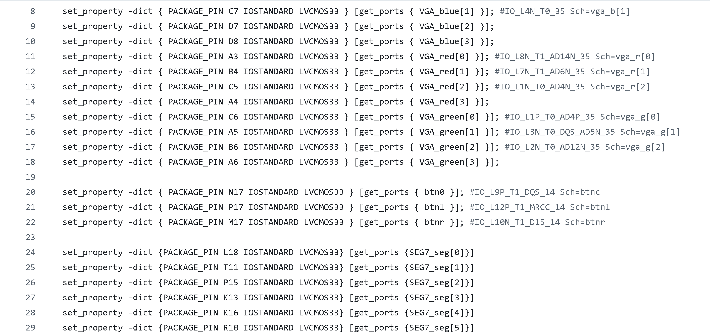
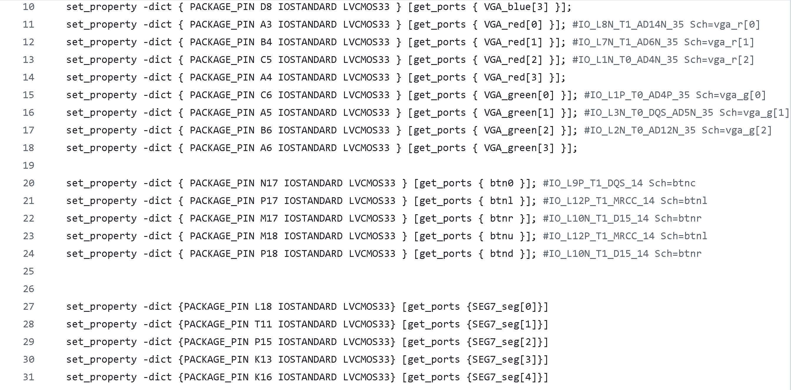

# CPE487_Final_Project - Agar.io Game 
## Description
In the game agario, you control a main ball and move over the other balls on the screen. Each of the other balls could either increase or decrease your overall score. 

Goal: Grow your main ball size. 

Playing: 
  - Use BTNC to start the game.
  - Use BTNU to move up, BTND to move down, BTNR to move right, and BTNL to move left.
    
Scoring: When the ball has reached a certain size the game will end.

## Required Attachments
For game play, you will need the following
- Nexys A7-100T Board
- VGA to HDMI Adapter
- Monitor

## Steps to Run
Download the following files from this repository onto your computer
- `ball.vhd`
- `clk_wiz_0_clk_wiz.vhd`
- `clk_wiz_0.vhd`
- `leddec16.vhd`
- `vga_sync.vhd`
- `agario.xdc`
- `agario.vhd`

Once downloaded, follow these steps:
1. Create a new project on Vivado
2. Add all the `.vhd` files as source files to the project
3. Add the `.xdc` file as a constraint file to the project
4. Choose Nexys A7-100T board for the project
5. Run the synthesis
6. Run the implementation
7. Generate the bistream
8. Open the hardware manager and click
   - 'Open Target'
   - 'Auto Connect'
   - 'Program Device'
     
9. Push the BTNC button to start the game

## Inputs and Outputs
## Modifications

### `agario.xdc`
_This code originated from the `pong.xdc` file in Lab 6_

**Initial:**

**Modified:**

- Added the button BTNU and BTND to allow the ball to move up and down (Shown on line 23 and 24)

### `agario.vhd`

**Initial:**

**Modified:**

### `ball.vhd`

**Initial:**

**Modified:**

## Process Summary 

### Responsibilities

Rebecca Kaspar:
- Contributed to GitHub repository
- Added the small ball randomization

Nadia Lara:
- Contributed to GitHub repository
- Added score counter 

### Difficulties

- Generating multiple balls in 'random' places
  

- Having the main ball increase when coming in contact with the other balls
    - The main ball score will not increase if not completely hovering the other ball

### Timeline

The project was completed in the last week with equal work being done by both parties. 
